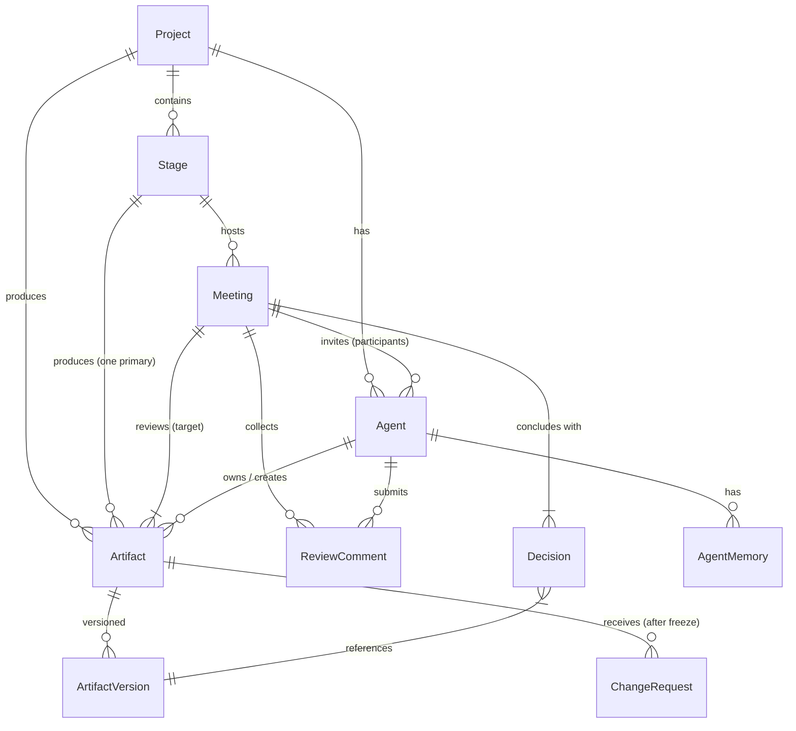
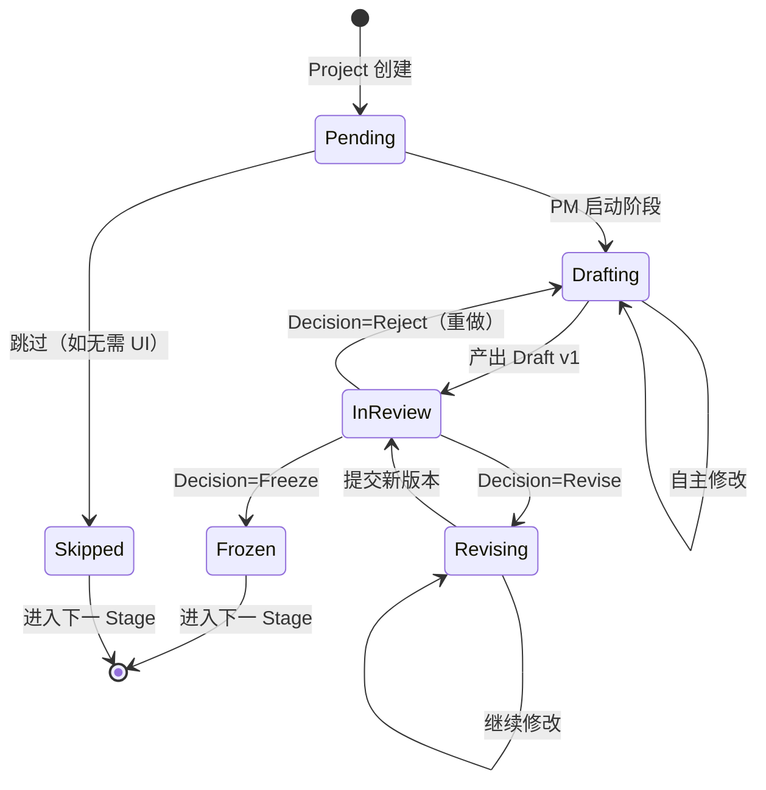
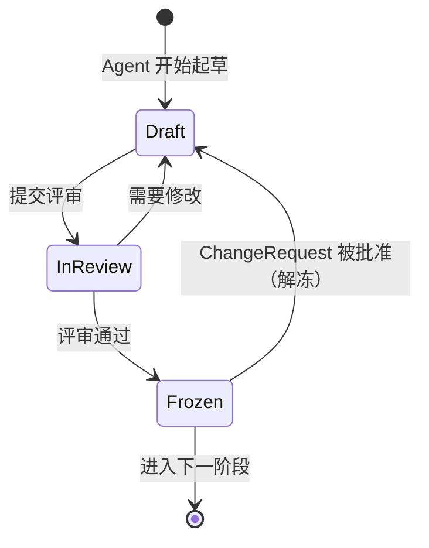

# AI Software Company — 架构设计

> 一个模拟真实软件团队的多 Agent 协作系统。
> 核心不是 Agent，而是 **Artifact（产物）+ Meeting（评审）+ Consensus（共识）+ Freeze（冻结）**。

---

## 1. 系统总览架构

```
┌─────────────────────────────────────────────────────────────────────────┐
│                         Orchestration Engine                             │
│  ┌──────────────┐  ┌──────────────┐  ┌──────────────┐  ┌─────────────┐  │
│  │ StageManager │  │MeetingSched  │  │  Consensus   │  │  Freeze     │  │
│  │              │  │              │  │  Engine      │  │  Manager    │  │
│  └──────────────┘  └──────────────┘  └──────────────┘  └─────────────┘  │
└──────────────────────────────────┬──────────────────────────────────────┘
                                   │
┌──────────────────────────────────┴──────────────────────────────────────┐
│                          Agent Runtime (Reasonix)                        │
│  ┌────────┐ ┌────────┐ ┌────────┐ ┌────────┐ ┌────────┐ ┌────────┐     │
│  │  PM    │ │  UI    │ │TechLead│ │Backend │ │Frontend│ │   QA   │     │
│  │ Agent  │ │ Agent  │ │ Agent  │ │ Agent  │ │ Agent  │ │ Agent  │     │
│  └────────┘ └────────┘ └────────┘ └────────┘ └────────┘ └────────┘     │
│  ┌────────┐ ┌────────┐ ┌────────┐                                      │
│  │ DevOps │ │  Doc   │ │Project │                                      │
│  │ Agent  │ │ Agent  │ │Manager │  ← 调度者，无投票权                    │
│  └────────┘ └────────┘ └────────┘                                      │
└──────────────────────────────────┬──────────────────────────────────────┘
                                   │
┌──────────────────────────────────┴──────────────────────────────────────┐
│                       Persistence (文件系统 + Git)                        │
│                                                                          │
│  .aisc/                                                                  │
│  ├── stages/01-requirement/   ← Stage 文件夹隔离                         │
│  ├── stages/04-api/                                                      │
│  ├── meetings/01-requirement/  ← 会议按 Stage 隔离                       │
│  ├── memory/pm-agent/         ← Agent 记忆文件夹隔离                     │
│  │   └── knowledge-001.json   ← 一条记忆一个文件（OKF 节点）              │
│  └── memory/backend/                                                     │
│                                                                          │
│  docs/        ← 非代码 Artifact（PRD、API Spec...）                       │
│  backend/     ← 后端代码（Git 管理）                                      │
│  frontend/    ← 前端代码（Git 管理）                                      │
└─────────────────────────────────────────────────────────────────────────┘
```

### 分层说明

| 层 | 职责 | 关键约束 |
|----|------|----------|
| **编排引擎层** | 控制 Stage 流转、创建会议、汇总决策、管理 Freeze | 整个系统的"大脑"，状态全部落在 `.aisc/` 目录 |
| **Agent 运行时层** | 基于 Reasonix，每个 Agent 一个独立 session | Agent 之间不直接通信，通过编排层路由 |
| **持久层** | 文件系统 + Git，无外部数据库 | `.aisc/` 存元数据，`docs/` 存 Artifact，代码走 Git |

> 注：不引入 PostgreSQL / Redis / MongoDB。MVP 只需要文件 I/O。

---

## 2. 领域模型



### 2.1 Project（项目）

整个系统的顶层容器。一个用户可以有多个 Project。

| 属性 | 类型 | 说明 |
|------|------|------|
| id | string | 唯一标识 |
| name | string | 项目名称 |
| description | string | 初始需求描述 |
| current_stage | Stage | 当前所处阶段 |
| status | enum | `active`, `paused`, `completed`, `archived` |
| created_at | datetime | |
| tech_stack | object | 用户指定的技术栈偏好 |
| user_intervention_mode | enum | `full_auto`, `interruptible`, `manual` |

### 2.2 Stage（阶段）

软件生命周期的阶段。任何时候一个 Project 只能有一个活跃 Stage。

**Stage 分两层：**

| 层级 | 说明 | 示例 |
|------|------|------|
| **父 Stage** | SDLC 阶段，顺序执行 | Requirement, Prototype, TechDesign, API, Database, BackendDev, FrontendDev, Integration, Testing, Release |
| **子 Stage** | 父 Stage 内的并行/串行单元 | BackendDev 下拆成 API-1、API-2、API-3... 每个接口一个子 Stage |

**预定义父 Stage 列表：**

```
Requirement  →  Prototype  →  TechDesign  →  API  →  Database
    →  BackendDev  →  FrontendDev  →  Integration  →  Testing  →  Release
```

**BackendDev 和 FrontendDev 的拆分规则：**

- BackendDev 按 API 维度拆分：每个接口 = 一个子 Stage
- FrontendDev 按页面维度拆分：每个页面 = 一个子 Stage
- 每个子 Stage 独立走 **Draft → Review → Freeze** 流程
- 子 Stage 可以由多个 Agent 并行执行（互不依赖的接口/页面同时开发）
- 父 Stage 在所有子 Stage Freeze 后才算完成

**子 Stage 示例（BackendDev）：**

```
BackendDev（父 Stage）
├── API-1: POST /video          ← 子 Stage（独立 Draft→Review→Freeze）
├── API-2: GET /video/:id       ← 子 Stage
├── API-3: POST /favorite       ← 子 Stage
└── API-4: GET /favorites       ← 子 Stage（可与 API-3 并行）
```

**Stage 状态机（见第 3 节）**

| 属性 | 类型 | 说明 |
|------|------|------|
| id | string | |
| project_id | string | 所属项目 |
| parent_stage_id | string | 父 Stage id（子 Stage 才有，null = 父 Stage） |
| type | enum | 阶段类型枚举 |
| status | enum | `pending`, `drafting`, `in_review`, `revising`, `frozen`, `skipped` |
| order | int | 执行顺序 |
| owner_agent | string | 负责产出的 Agent |
| reviewer_agents | string[] | 参与评审的 Agent 列表 |
| artifact_id | string | 本阶段产出的主要 Artifact |
| meeting_ids | string[] | 本阶段产生的所有 Meeting |

### 2.3 Artifact（产物）

项目中任何可被评审、版本化的产物。代码也是一种 Artifact。

**Artifact 类型：**

| 类型 | 说明 | 负责 Agent |
|------|------|-----------|
| PRD | 产品需求文档 | PM |
| Prototype | UI 原型 / 交互设计 | UI Designer |
| TechDesign | 技术方案 / 架构 | Tech Lead |
| APISpec | 接口规范（OpenAPI） | Tech Lead |
| DBSchema | 数据库设计 / Migration | Tech Lead |
| BackendCode | 后端代码（按接口拆分） | Backend |
| FrontendCode | 前端代码（按页面拆分） | Frontend |
| TestPlan | 测试计划 | QA |
| TestCase | 测试用例 | QA |
| Documentation | README / API 文档 | Documentation |
| Deployment | Dockerfile / CI/CD | DevOps |

| 属性 | 类型 | 说明 |
|------|------|------|
| id | string | |
| project_id | string | |
| stage_id | string | 关联的阶段 |
| type | enum | Artifact 类型 |
| owner_agent | string | 负责的 Agent |
| status | enum | `draft`, `in_review`, `approved`, `frozen`, `deprecated` |
| current_version | int | 当前版本号 |
| frozen_version | int | 冻结版本号（未冻结则为 null） |
| created_at | datetime | |

### 2.4 ArtifactVersion（产物版本）

每次修改产生一个新版本，保留完整历史。

| 属性 | 类型 | 说明 |
|------|------|------|
| id | string | |
| artifact_id | string | |
| version | int | 版本号，自增 |
| content | text | 完整内容 |
| diff_from_prev | text | 与上一版的 diff |
| created_by | string | Agent id |
| created_at | datetime | |
| trigger | enum | `initial_draft`, `review_revision`, `change_request` |

### 2.5 Meeting（会议）

系统的一等公民。所有评审通过 Meeting 完成。

| 属性 | 类型 | 说明 |
|------|------|------|
| id | string | |
| project_id | string | |
| stage_id | string | |
| type | enum | `requirement_review`, `design_review`, `tech_review`, `api_review`, `db_review`, `code_review`, `test_review`, `integration`, `release` |
| target_artifact_id | string | 评审的目标 Artifact |
| status | enum | `pending`, `in_progress`, `reviewing`, `consensus_reached`, `needs_revision`, `passed`, `failed` |
| moderator | string | 主持人 Agent（通常是 Project Manager 或 Tech Lead） |
| participants | string[] | 参与评审的 Agent 列表 |
| agenda | string | 会议议程 |
| created_at | datetime | |
| started_at | datetime | |
| ended_at | datetime | |

### 2.6 ReviewComment（评审意见）

每个参与 Agent 对 Artifact 的意见。

| 属性 | 类型 | 说明 |
|------|------|------|
| id | string | |
| meeting_id | string | |
| agent_id | string | 谁提的 |
| category | enum | `concern`, `suggestion`, `question`, `blocker`, `approve` |
| content | string | 具体意见 |
| references | string[] | 引用的 Artifact 片段 |
| created_at | datetime | |

### 2.7 Decision（决策）

每次 Meeting 的核心产出。不是聊天记录，是明确的决策。

| 属性 | 类型 | 说明 |
|------|------|------|
| id | string | |
| meeting_id | string | |
| type | enum | `adopt`（通过）, `reject`（驳回）, `revise`（修改后重审）, `freeze`（冻结并进入下一阶段） |
| summary | string | 决策摘要 |
| action_items | ActionItem[] | 具体的修改任务列表 |
| decided_by | string | 决策者（通常是主持人或用户） |
| decided_at | datetime | |
| target_version | int | 指向冻结的 ArtifactVersion |

### 2.8 ActionItem（行动项）

Decision 中的具体任务。

| 属性 | 类型 |
|------|------|
| id | string |
| decision_id | string |
| assignee | string（Agent id） |
| description | string |
| status | `pending`, `done` |

### 2.9 Agent（团队成员）

| 属性 | 类型 | 说明 |
|------|------|------|
| id | string | |
| role | enum | 角色枚举 |
| name | string | 显示名称 |
| system_prompt | string | 角色 Prompt |
| tools | string[] | 可用的工具列表 |
| llm_provider | string | 使用的模型 |
| llm_tier | enum | `strong`（强推理，如 PM/Tech Lead）, `standard`（标准，如 Backend/Frontend/QA） |
| status | enum | `idle`, `working`, `reviewing` |

**各 Agent LLM 能力要求：**

| Agent | LLM Tier | 原因 |
|-------|----------|------|
| Project Manager | **Strong** | 需要汇总多方意见、识别冲突、做裁决，是整个系统的推理中枢 |
| Tech Lead | **Strong** | 架构设计、API 设计、数据库设计需要深度技术推理 |
| PM Agent | Standard | 需求文档编写，任务明确，不需要强推理 |
| UI Designer | Standard | 原型设计，输入输出明确 |
| Backend | Standard | 按接口文档实现，但需要读已有代码的能力 |
| Frontend | Standard | 按 UI + API 实现页面 |
| QA | Standard | 按 PRD + API 生成测试用例 |
| DevOps | Standard | 按技术方案生成部署配置 |
| Documentation | Standard | 按代码和设计生成文档 |

**各 Agent 职责矩阵：**

| 角色 | 做什么 | 不能做什么 |
|------|--------|-----------|
| **Project Manager**（调度者） | 流程调度：创建 Stage、组织会议、汇总裁决、判断 Freeze | ❌ 不写代码、不画 UI、不写 PRD、不设计 API、不参与内容投票 |
| **PM Agent**（产品经理） | 需求分析 + PRD 撰写；参与所有评审会议回答业务问题 | ❌ 不设计 UI、不定义 API、不写代码 |
| **UI Designer**（UI 设计师） | 根据冻结的 PRD 输出页面原型、交互说明、组件清单 | ❌ 不写前端代码、不定义 API |
| **Tech Lead**（技术负责人） | 技术架构、**API 设计**、数据库设计、Code Review | ❌ 不写业务代码 |
| **Backend Developer**（后端开发） | 按冻结的 API Spec 逐个接口实现后端代码 | ❌ 不设计 API（那是 Tech Lead 的工作），不自己决定接口长什么样 |
| **Frontend Developer**（前端开发） | 按冻结的 Prototype + API Spec 逐个页面实现前端代码 | ❌ 不修改 UI 设计、不定义 API |
| **QA Tester**（测试工程师） | 根据 PRD + API Spec 写测试方案和用例，执行测试，记录 Bug | ❌ 不修改代码、不修改需求 |
| **DevOps**（运维工程师） | Dockerfile、CI/CD、部署配置（Release Stage 被调用） | ❌ 不写业务代码 |
| **Documentation**（文档工程师） | 自动生成 README、API 文档、CHANGELOG（Release Stage 被调用） | ❌ 不写代码 |

> 核心原则：**设计的人不实现，实现的人不设计**。Tech Lead 设计 API，Backend 实现；UI Designer 设计原型，Frontend 实现；PM 写 PRD，所有人评审。保证评审时有独立的视角来挑问题。

### 2.10 AgentMemory（Agent 长期记忆 + OKF）

每个 Agent 维护自己的长期记忆。记忆以文件形式存储在 `.aisc/memory/{agent-id}/` 目录下。

**设计原则：渐进式披露 + OKF**

- **渐进式披露**：不把所有记忆一次性塞进上下文。编排引擎根据当前 Stage 和任务，只检索最相关的记忆，按需注入 Agent 的 System Prompt。
- **OKF（Ontology Knowledge Framework）**：记忆不是孤立的文本片段，而是带关系的知识节点。每条记忆通过 `relations` 字段关联到其他记忆、Artifact、Stage 或 Meeting。

```
OKF 知识图谱示意（以 Backend Agent 为例）：

  [分页统一用 cursor] ──based_on──→ [API Review Meeting #004]
         │
         ├──supersedes──→ [之前用 offset 分页的决定]
         │
         └──referenced_by──→ [QA: 分页测试用例需覆盖 cursor 为空场景]
```

**记忆类型：**

| 类型 | 说明 | 示例 |
|------|------|------|
| `knowledge` | 技术知识、约定、模式 | "分页统一使用 cursor，返回 next_cursor + has_more" |
| `decision` | 会议决策记录 | "API Review #004: 采用 cursor 分页，否决 offset 方案" |
| `lesson` | 经验教训 | "上次因为没加事务导致收藏接口在并发场景下重复插入" |
| `reference` | 指向外部资源 | "参考 docs/prd-v2.md §4.2 的收藏业务规则" |

**记忆节点属性：**

| 属性 | 类型 | 说明 |
|------|------|------|
| id | string | 唯一标识 |
| agent_id | string | 所属 Agent |
| type | enum | `knowledge`, `decision`, `lesson`, `reference` |
| title | string | 一句话标题（用于检索匹配） |
| content | text | 完整内容 |
| tags | string[] | 检索标签，如 `["分页", "cursor", "API设计"]` |
| relations | Relation[] | OKF 关系列表 |
| related_artifact_ids | string[] | 引用的 Artifact |
| related_meeting_ids | string[] | 引用的 Meeting |
| created_at | datetime | |
| updated_at | datetime | |
| access_count | int | 被检索次数（用于判断记忆热度） |

**Relation 结构：**

| 属性 | 说明 |
|------|------|
| type | 关系类型：`based_on`, `supersedes`, `referenced_by`, `conflicts_with`, `extends` |
| target_type | 目标类型：`memory`, `artifact`, `meeting`, `stage` |
| target_id | 目标 ID |

**渐进式披露策略：**

```
检索优先级（编排引擎在构造 Agent 上下文时执行）：

1. 直接关联：当前 Artifact / Meeting 的 ID 直接引用的记忆 → 必加载
2. 标签匹配：当前 Stage 类型 + 任务关键词匹配 tags → 按 BM25 分数取 top-5
3. OKF 扩展：上述记忆的 relations 中引用的关联记忆 → 最多扩展 1 跳
4. 热门记忆：access_count 最高但未被上述规则命中的记忆 → top-3

总记忆注入上限：每 Agent 每轮不超过 8 条记忆（约 2000 tokens）
```

### 2.11 ChangeRequest（变更请求）

Freeze 之后，任何修改必须通过 ChangeRequest。

| 属性 | 类型 | 说明 |
|------|------|------|
| id | string | |
| artifact_id | string | |
| requested_by | string | Agent id |
| reason | string | 变更原因 |
| impact | string | 影响评估 |
| status | enum | `pending`, `approved`, `rejected` |
| requires_re_freeze | bool | 是否需要重新冻结下游 Artifact |

---

## 3. Stage 状态机



**Stage 流转规则：**

1. 只有上一个 Stage `Frozen`（或被 `Skipped`），下一个 Stage 才能进入 `Pending → Drafting`
2. `InReview` 状态下的循环次数有上限（默认 5 轮），超出则升级给用户处理
3. 用户可随时介入将任意 Stage 设为 `Paused` 或强制 `Freeze`

---

## 4. Artifact 生命周期



**版本管理规则：**

- 每个 Artifact 从 v1 开始
- 每次 `Draft → InReview` 提交时自动递增版本
- 只有 `Frozen` 版本的 Artifact 可以被下游 Stage 引用
- 下游 Stage 基于上游 Frozen Artifact 开始工作
- ChangeRequest 被批准后，上游 Artifact 解冻，下游已 Frozen 的 Artifact 标记为 `stale`

---

## 5. 会议机制详细设计

### 5.1 整体流程

```
┌─────────────────────────────────────────────────────────────────────┐
│                        Meeting Lifecycle                             │
│                                                                      │
│  1. 创建会议                                                         │
│     Project Manager 检测到 Artifact 进入 InReview 状态               │
│     → 自动创建 Meeting（type 根据 Stage 决定）                       │
│     → 确定参与者（根据 Stage 预设的 reviewer_agents）                │
│     → 确定主持人（Moderator）                                        │
│                                                                      │
│  2. 并行审阅（核心）                                                  │
│     ┌─────────┐  ┌─────────┐  ┌─────────┐  ┌─────────┐              │
│     │   PM    │  │TechLead │  │ Frontend│  │   QA    │  ...         │
│     │ reviews │  │ reviews │  │ reviews │  │ reviews │              │
│     └────┬────┘  └────┬────┘  └────┬────┘  └────┬────┘              │
│          │            │            │            │                    │
│          ▼            ▼            ▼            ▼                    │
│     ReviewComment  ReviewComment  ReviewComment  ReviewComment       │
│                                                                      │
│  3. 汇总裁决                                                         │
│     Moderator 收集所有 ReviewComment                                 │
│     → 识别冲突（A 说 X，B 说 Y，互相矛盾）                          │
│     → 分类（blocker / suggestion / question）                       │
│     → 生成 Decision（adopt / revise / reject）                      │
│     → 生成 ActionItem 列表                                           │
│                                                                      │
│  4. 执行决策                                                         │
│     Revise → Artifact owner 修改 → 重新进入审阅                      │
│     Adopt  → 更少修改，直接通过                                      │
│     Freeze → 冻结，Stage 结束                                        │
│     Reject → 打回重做，Draft 重新开始                                │
│                                                                      │
│  5. 沉淀纪要                                                         │
│     Meeting 结束后自动生成 MeetingMinutes                            │
│     → 存入长期记忆（每个 Agent 可以引用）                            │
│     → Artifact Freeze 时的 Decision 作为"共识证明"                   │
└─────────────────────────────────────────────────────────────────────┘
```

### 5.2 并行审阅机制

这是你选的方案，细节展开：

```
并行审阅流程：

1. Moderator 发出审阅请求，携带：
   - 目标 Artifact（当前版本内容）
   - 上下文摘要（上游已冻结的 Artifact 摘要）
   - 评审指引（本 Stage 的审阅重点）

2. 每个参与者 Agent 独立并行执行：
   - 读取 Artifact 内容
   - 基于自己的角色视角 + 长期记忆 提出意见
   - 输出结构化的 ReviewComment
   
   关键：Agent 之间互相看不到对方的评论（避免从众偏差）

3. Moderator 收到所有评论后（或超时后），调用汇总 LLM：
   - 输入：Artifact + 所有 ReviewComment
   - 任务：
     a. 按 theme 聚类（如：分页方案、错误码、字段命名...）
     b. 标注冲突（Agent A 和 Agent B 在某点上意见相反）
     c. 标注 blocker（不解决无法继续的问题）
     d. 建议 Decision 类型
   - 输出：结构化的 Decision draft

4. Moderator 做出最终 Decision：
   - 如果所有 Agent 都 Approve → 直接 Freeze
   - 如果有 blocker → Revise，生成 ActionItem
   - 如果有冲突 → Moderator 裁决（优先 Tech Lead 意见，技术问题；PM 意见，业务问题）
   - 如果冲突无法裁决 → 升级给用户

5. Decision 公示给所有参与者（透明，但不再次投票）
```

### 5.3 会议类型与参与者矩阵

| 会议类型 | 主持人 | 必选参与者 | 可选参与者 | 评审目标 |
|---------|--------|-----------|-----------|---------|
| Requirement Review | PM | UI, Tech Lead, Backend, Frontend, QA | DevOps | PRD |
| Design Review | UI Designer | PM, Frontend, Backend | QA | Prototype |
| Tech Review | Tech Lead | Backend, Frontend | PM, QA | TechDesign |
| API Review | Tech Lead | Backend, Frontend, QA | PM | APISpec |
| DB Review | Tech Lead | Backend, QA | — | DBSchema |
| Code Review | Tech Lead | 对应 Dev Agent | QA | BackendCode / FrontendCode |
| Test Review | QA | Backend, Frontend, PM | — | TestPlan / TestCase |
| Integration | PM | Backend, Frontend, QA | — | 整体集成状态 |
| Release | PM | 所有人 | — | 发布就绪确认 |

---

## 6. Agent 运行时架构

### 6.1 Agent 执行模型

```
┌──────────────────────────────────────┐
│           Agent Instance             │
│                                      │
│  ┌────────────────────────────────┐  │
│  │        System Prompt           │  │
│  │  - Role definition             │  │
│  │  - Responsibility scope        │  │
│  │  - Output format constraints   │  │
│  │  - "你不知道的事情不要假设"      │  │
│  └────────────────────────────────┘  │
│                                      │
│  ┌────────────────────────────────┐  │
│  │        Context Builder         │  │
│  │  - 当前 Stage 信息              │  │
│  │  - 上游 Frozen Artifact 摘要    │  │
│  │  - 本次任务目标                 │  │
│  │  - 相关长期记忆检索             │  │
│  └────────────────────────────────┘  │
│                                      │
│  ┌────────────────────────────────┐  │
│  │        Tool Executor           │  │
│  │  - read_artifact               │  │
│  │  - write_artifact              │  │
│  │  - submit_review               │  │
│  │  - search_memory               │  │
│  │  - execute_code  (Dev only)    │  │
│  │  - run_test      (QA only)     │  │
│  └────────────────────────────────┘  │
│                                      │
│  ┌────────────────────────────────┐  │
│  │        LLM Provider            │  │
│  │  - Model: configurable         │  │
│  │  - Streaming: supported        │  │
│  └────────────────────────────────┘  │
└──────────────────────────────────────┘
```

### 6.2 各 Agent 权限矩阵

| Agent | read_artifact | write_artifact | execute_code | submit_review | manage_meeting | manage_stage | git_ops | read_codebase |
|-------|:---:|:---:|:---:|:---:|:---:|:---:|:---:|:---:|
| Project Manager | ✅ | ❌ | ❌ | ❌ | ✅ | ✅ | ❌ | ❌ |
| PM Agent | ✅ | ✅ (PRD) | ❌ | ✅ | ❌ | ❌ | ❌ | ❌ |
| UI Designer | ✅ | ✅ (Prototype) | ❌ | ✅ | ❌ | ❌ | ❌ | ❌ |
| Tech Lead | ✅ | ✅ (TechDesign, APISpec, DBSchema) | ❌ | ✅ (主持技术类会议) | ❌ | ❌ | ❌ | ✅ |
| Backend | ✅ | ✅ (BackendCode) | ✅ | ✅ | ❌ | ❌ | ✅ | ✅ |
| Frontend | ✅ | ✅ (FrontendCode) | ✅ | ✅ | ❌ | ❌ | ✅ | ✅ |
| QA | ✅ | ✅ (TestPlan, TestCase) | ✅ | ✅ | ❌ | ❌ | ❌ | ✅ |
| DevOps | ✅ | ✅ (Deployment) | ✅ | ✅ | ❌ | ❌ | ✅ | ✅ |
| Documentation | ✅ | ✅ (Documentation) | ❌ | ❌ | ❌ | ❌ | ✅ | ✅ |

**新增权限说明：**

| 权限 | 说明 |
|------|------|
| `git_ops` | 在 Git 仓库中创建分支、提交代码、创建 Tag、发起 PR |
| `read_codebase` | 读取项目已有代码（非本项目产出的代码），理解现有架构和约定 |

> 注：DevOps 和 Documentation 不参与大多数评审会议，只在各自 Stage 被调用。
> Backend 和 Frontend Agent 在开发时，先通过 `read_codebase` 了解现有代码风格和架构约定，再动手写代码。

### 6.3 Agent 间通信规则

**Agent 之间不直接通信。** 所有信息交换通过以下三种途径：

```
途径 1：Artifact（正式交付物）
  Backend 产出 APISpec → Freeze → Frontend 读取 Frozen APISpec → 开始开发

途径 2：Meeting（评审意见交流）
  Agent A 提 ReviewComment → Moderator 汇总 → Agent B 看到汇总后的 Decision

途径 3：AgentMemory（长期知识引用）
  Backend 写入记忆："分页统一用 cursor" → QA 在写测试用例时检索到这条记忆
```

---

## 7. 编排引擎设计

### 7.1 StageManager

负责 Stage 的生命周期管理：

```
StageManager:
  - 维护 Stage 状态机
  - 当前 Stage Frozen → 自动激活下一个 Stage
  - 检测到 Artifact 进入 InReview → 通知 MeetingScheduler
  - 处理 Stage 跳过逻辑（某些项目不需要 UI 阶段）
  - 处理用户干预（暂停、跳过、强制推进）
```

### 7.2 MeetingScheduler

负责会议的创建和生命周期：

```
MeetingScheduler:
  - 收到审阅请求 → 创建 Meeting 对象
  - 确定参与者（从 Stage 配置中读取）
  - 确定主持人
  - 构建审阅上下文 → 分发给各 Agent
  - 收集 ReviewComment → 超时处理
  - 触发 ConsensusEngine
```

### 7.3 ConsensusEngine

核心决策引擎：

```
ConsensusEngine:
  输入：Artifact + [ReviewComment]
  
  步骤：
  1. 聚类：按议题分组（如"分页方案"、"错误处理"、"命名规范"）
  2. 标注：给每组标严重程度（blocker / important / nice-to-have）
  3. 检测冲突：两个 Agent 在同一议题上意见相左
  4. 建议决策：
     - 无 blocker 且无冲突 → 建议 Freeze
     - 有 blocker → 建议 Revise，列出 ActionItem
     - 有冲突 → 标记冲突，建议 Moderator 裁决
  5. 输出：结构化 Decision draft
  
  冲突裁决优先级（自动）：
  技术问题：Tech Lead > Backend ≈ Frontend > QA
  产品问题：PM > UI > Tech Lead
  无法裁决 → 升级用户
```

### 7.4 FreezeManager

管理冻结和解冻：

```
FreezeManager:
  - Artifact Freeze：锁定当前版本，生成快照
  - Stage Freeze：确认本阶段产物已冻结，允许进入下一阶段
  - ChangeRequest 处理：
    - 接收变更请求
    - 评估影响范围（哪些下游 Artifact 会受影响）
    - 若批准 → 解冻本 Artifact + 标记下游为 stale
    - 下游 stale Artifact 需要重新走 Draft → Review → Freeze

Git 集成（代码类 Artifact）：
  - 代码类 Artifact（BackendCode、FrontendCode、Deployment）直接操作 Git 仓库
  - Draft 阶段：Agent 在 feature 分支上开发
  - Freeze = Git Tag（如 api-video-create-v2）
  - ChangeRequest = 新分支 + PR
  - 非代码类 Artifact（PRD、APISpec、Prototype 等）以文件形式存于 `docs/` 目录，走版本化文件名或 Git LFS

Freeze 的 Git 工作流：
  1. Agent 在 feature/api-video-create 分支开发
  2. Code Review 通过，Decision = Freeze
  3. FreezeManager 执行：
     - 合并到 main/master
     - 打 Tag：freeze/backedndev/api-video-create/v1
     - 记录 Tag → ArtifactVersion 的映射
  4. 后续 ChangeRequest → 从 Tag 切出新分支 → 修改 → PR → 新 Tag
```

---

## 8. 持久层：文件系统 + 项目目录结构

不引入任何外部数据库。所有状态、产物、元数据都以文件形式存在项目目录中。

### 8.1 项目目录布局

```
my-project/                         # 项目根目录（同时也是 Git 仓库）
│
├── .aisc/                          # 系统元数据
│   ├── project.json                # 项目状态
│   │
│   ├── stages/                     # 按 Stage 文件夹隔离，每个 Stage 一个子目录
│   │   ├── 01-requirement/
│   │   │   ├── stage.json          # Stage 状态和元数据
│   │   │   └── artifact/           # 本 Stage 产出的 Artifact 快照
│   │   │       ├── prd-v1.md
│   │   │       └── prd-v2.md       # 冻结版本
│   │   │
│   │   ├── 02-prototype/
│   │   │   ├── stage.json
│   │   │   └── artifact/
│   │   │
│   │   ├── 03-tech-design/
│   │   │   ├── stage.json
│   │   │   └── artifact/
│   │   │
│   │   ├── 04-api/
│   │   │   ├── stage.json
│   │   │   └── artifact/
│   │   │       └── api-spec.yaml
│   │   │
│   │   ├── 05-database/
│   │   │   ├── stage.json
│   │   │   └── artifact/
│   │   │       └── migration.sql
│   │   │
│   │   ├── 06-backend-dev/         # 父 Stage，含子 Stage
│   │   │   ├── stage.json
│   │   │   └── sub-stages/
│   │   │       ├── post-video/
│   │   │       │   ├── sub-stage.json
│   │   │       │   └── impl-doc.md  # 接口实现文档
│   │   │       └── get-video/
│   │   │           ├── sub-stage.json
│   │   │           └── impl-doc.md
│   │   │
│   │   └── ...
│   │
│   ├── meetings/                   # 按 Stage 文件夹隔离
│   │   ├── 01-requirement/
│   │   │   ├── meeting-001-review.md
│   │   │   └── meeting-002-review.md
│   │   ├── 04-api/
│   │   │   └── meeting-003-review.md
│   │   └── ...
│   │
│   └── memory/                     # 按 Agent 文件夹隔离
│       ├── pm-agent/
│       │   ├── knowledge-001.json  # 一条记忆 = 一个 JSON 文件
│       │   ├── decision-002.json
│       │   └── ...
│       ├── tech-lead/
│       │   ├── knowledge-003.json
│       │   └── ...
│       ├── backend/
│       ├── frontend/
│       ├── qa/
│       └── ...
│
├── docs/                           # 非代码类 Artifact（工作副本）
│   ├── prd.md                      # 当前最新版本
│   ├── api-spec.yaml
│   ├── db-schema.sql
│   └── prototype/                  # UI 原型描述文件
│
├── backend/                        # 后端代码（正常项目结构，Git 管理）
│   └── ...
│
├── frontend/                       # 前端代码
│   └── ...
│
└── README.md
```

**文件夹天然隔离的好处：**

| 隔离维度 | 文件夹结构 | 效果 |
|---------|-----------|------|
| Stage 之间 | `stages/01-requirement/`, `stages/04-api/`... | 每个 Stage 的产物和状态独立，互不污染 |
| Meeting 按 Stage | `meetings/01-requirement/`, `meetings/04-api/`... | 快速定位某个 Stage 的所有会议 |
| Agent 记忆 | `memory/pm-agent/`, `memory/backend/`... | 每个 Agent 的记忆物理隔离，不会被其他 Agent 无意读取 |
| 单条记忆 | 一个记忆 = 一个 JSON 文件 | 便于增删改查，便于 OKF 关系检索，便于 Reasonix 的 BM25 做文件级检索 |
│   └── ...
│
├── frontend/                      # 前端代码
│   └── ...
│
└── README.md
```

### 8.2 project.json

```json
{
  "name": "ai-video-platform",
  "description": "AI 视频平台",
  "current_stage": "api",
  "status": "active",
  "created_at": "2026-07-01T10:00:00Z",
  "tech_stack": {
    "backend": "go",
    "frontend": "react",
    "database": "postgresql"
  }
}
```

### 8.3 Stage JSON（以 backend-dev.json 为例）

```json
{
  "id": "stage-backend-dev",
  "type": "BackendDev",
  "status": "drafting",
  "order": 6,
  "owner_agent": "backend",
  "reviewer_agents": ["tech-lead", "qa"],
  "artifact_id": "backend-code",
  "meeting_ids": ["meeting-005", "meeting-006"],
  "sub_stages": [
    {
      "id": "sub-post-video",
      "api": "POST /api/v1/video",
      "status": "frozen",
      "artifact_version": 3,
      "git_tag": "freeze/backenddev/post-video/v3"
    },
    {
      "id": "sub-get-video",
      "api": "GET /api/v1/video/{id}",
      "status": "in_review",
      "artifact_version": 2
    }
  ]
}
```

### 8.4 Meeting Markdown

每个会议记录为独立 `.md` 文件：

```markdown
---
id: meeting-001
type: requirement_review
stage: requirement
target_artifact: docs/prd-v1.md
moderator: project-manager
participants:
  - pm-agent
  - tech-lead
  - ui-designer
  - backend
  - frontend
  - qa
status: passed
created_at: 2026-07-01T11:00:00Z
---

# Requirement Review — PRD v1

## Discussion

### 🔴 Blocker
- **Tech Lead**: 分页方案未明确，建议补充
- **QA**: 异常流程缺失（网络超时、并发冲突）

### 🟡 Important
- **Frontend**: 建议 API 字段中增加缩略图 URL
- **Backend**: 确认视频上传大小上限

### 🟢 Suggestion
- **UI**: 空状态需要补充设计

## Decision

**Type**: Revise

**Summary**: PRD 需要补充分页方案、异常流程、缩略图字段。修改后重新评审。

**Action Items**:
- [ ] pm-agent: 补充分页方案说明
- [ ] pm-agent: 补充异常流程（网络超时、并发冲突）
- [ ] pm-agent: 补充缩略图 URL 字段
```

### 8.5 为什么不需要数据库

| 需求 | 文件系统方案 | 为什么够用 |
|------|------------|-----------|
| 项目/Stage 状态 | JSON 文件 | 单项目场景，读写频率极低，JSON 足够 |
| Artifact 版本历史 | Git + 版本化文件名 | Git 天然解决版本、diff、回溯 |
| Meeting 记录 | Markdown 文件 + YAML frontmatter | 人类可读，可搜索，可版本化 |
| Agent 长期记忆 | Reasonix 自带 `remember`/`memory` | 已实现 BM25 检索和持久化 |
| 实时协作 | 不需要 | 单用户，无并发写入冲突 |
| 复杂查询 | `grep` + `jq` | MVP 阶段不需要 |

---

## 9. 整体数据流

一次完整的需求评审流程：

```
  User
    │  ① 创建项目，给出需求
    ▼
  Project Manager
    │  ② 创建 Stage: Requirement
    │     分配 PM Agent 为 Owner
    ▼
  PM Agent
    │  ③ 起草 PRD v1
    │     (read: 用户原始需求)
    │     (write: PRD Artifact v1)
    ▼
  StageManager
    │  ④ 检测到 Artifact 状态变为 draft_complete
    │     更新 Stage 状态: drafting → in_review
    ▼
  MeetingScheduler
    │  ⑤ 创建 Meeting: Requirement Review
    │     参与者: UI, Tech Lead, Backend, Frontend, QA
    │     主持人: Project Manager
    ▼
  [并行] ──────────────────────────────────
    │         │         │         │
    ▼         ▼         ▼         ▼
  UI Agent  TL Agent  BE Agent  QA Agent ...
    │  ⑥ 各自审阅 PRD v1，输出 ReviewComment
    │     每个 Agent 看不到别人的评论
    │
  [收集完成或超时]
    ▼
  ConsensusEngine
    │  ⑦ 汇总所有 ReviewComment
    │     聚类、标注冲突、生成 Decision draft
    ▼
  Moderator (PM)
    │  ⑧ 审核 Decision draft，做出最终裁决
    │     结果: Revise（需要修改）
    │     ActionItem:
    │       - 增加分页方案说明
    │       - 补充空状态设计
    │       - 明确收藏幂等性
    ▼
  PM Agent
    │  ⑨ 根据 ActionItem 修改 PRD → v2
    │     重新提交 → 再次进入 Meeting
    │
    │     ... 可能多轮 ...
    │
    ▼
  Moderator
    │  ⑩ 所有参与者 Approve
    │     Decision: Freeze
    ▼
  FreezeManager
    │  ⑪ PRD v2 冻结
    │     Stage: Requirement → Frozen
    ▼
  StageManager
    │  ⑫ 激活下一 Stage: Prototype
    │     分配 UI Agent 为 Owner
    │     UI Agent 可以读取 Frozen PRD 作为输入
    ▼
    ... 循环 ...
```

---

## 10. 关键设计决策

以下是我在设计中主动做的取舍，以及与你确认后的最终决定：

### 已做的取舍

| 决策 | 理由 |
|------|------|
| Agent 之间不能直接通信 | 避免通信复杂度爆炸，确保流程可控、可替换 |
| 每个 Stage 只有一个主 Artifact | 简化状态机，多产物 Stage 通过子 Stage 拆分 |
| 审阅并行、决策集中 | 避免 Agent 互相影响（从众偏差），但由 Moderator 统一裁决保持效率 |
| Project Manager 没有投票权 | 它只是流程调度者，不是决策者，避免权力过于集中 |
| 长期记忆按 Agent 隔离 | 每个 Agent 维护自己的知识图谱，需要引用时通过引用机制而非共享上下文 |

### 与你确认后的决策

| # | 问题 | 决策 |
|---|------|------|
| 1 | BackendDev/FrontendDev 粒度 | **按接口/页面拆分子 Stage**。每个接口 = 一个子 Stage（Draft→Review→Freeze），每个接口需产出对应的接口文档。父 Stage 在所有子 Stage Freeze 后完成 |
| 2 | Project Manager LLM 能力 | **强推理 LLM**。PM 需要汇总多方意见、识别冲突、做裁决，是整个系统的推理中枢。Tech Lead 同样需要强推理能力 |
| 3 | 代码 Artifact 存储 | **直接操作 Git 仓库**。feature 分支开发，Freeze = Git Tag + merge main。非代码类 Artifact 以文件存于 `docs/` |
| 4 | 多项目并行 | **暂不做**。先实现单项目模式，一次只跑一个 Project。架构上保留扩展空间（Project 作为顶层容器已天然隔离），但 MVP 不实现并行调度 |
| 5 | 读已有代码 | **可以**。Backend/Frontend Agent 开发前先通过 `read_codebase` 了解现有代码风格和架构约定，而非从零写 |
| 6 | 持久层 | **文件系统 + Git，无数据库**。`.aisc/` 存元数据，`docs/` 存 Artifact，Git 管理版本。不引入 PostgreSQL / Redis / MongoDB |
| 7 | Agent 运行时 | **基于 Reasonix**。每个 Agent 是一个 Reasonix session，编排引擎通过 Reasonix 的 Agent Loop 驱动 |

---

## 后续规划

架构设计和 Prompt 设计均已定稿。下一步：

1. **实现编排引擎**：StageManager、MeetingScheduler、ConsensusEngine、FreezeManager
2. **对接 Reasonix**：用 Reasonix 作为每个 Agent 的运行时，编排层通过程序化调用驱动
3. **最小可行原型**：跑通一次"需求 → PRD → 需求评审 → Freeze → API 设计"
